# Assembly Guide

| Step | Description | Image |
|-|-|-|
| 1 | Assemble the base | 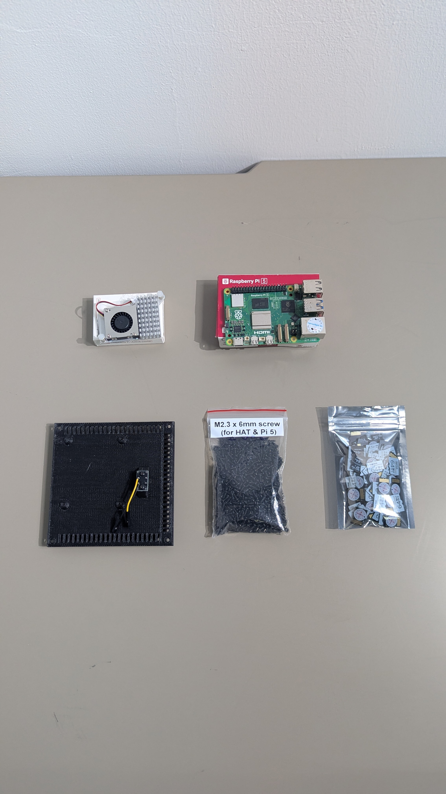 |
| 1.1 | Attach the Cooler to the Raspberry Pi5 board.  **Thermal Pads:** Ensure the protective plastic film is removed from the thermal pads on the underside of the cooler before placement. | 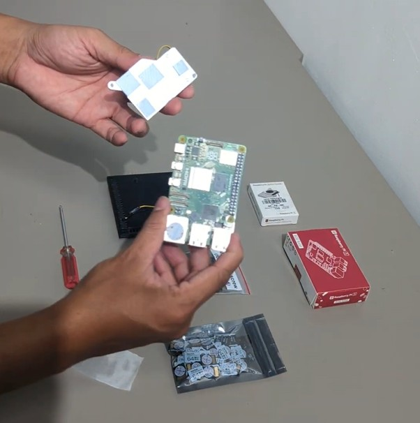 |
| 1.2 | **Alignment:** Locate the four mounting holes on the Raspberry Pi 5 board surrounding the main processor.  **Securing:** Gently press down on the push pins — ideally in a diagonal pattern — until they click into place to ensure even pressure across the chip. | 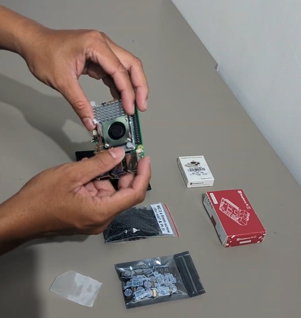 |
| 1.3 | Insert Memory card. | 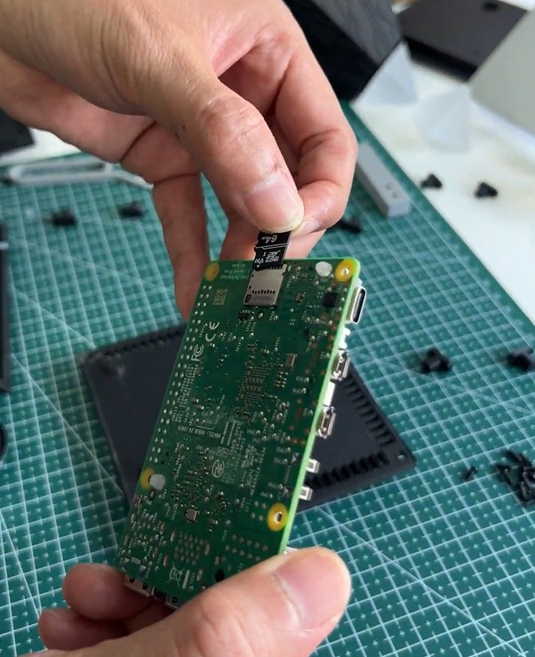 |
| 1.4 | Mount the Raspberry Pi5 board to the Base Plate: locate the four mounting holes on the Raspberry Pi 5 board. | 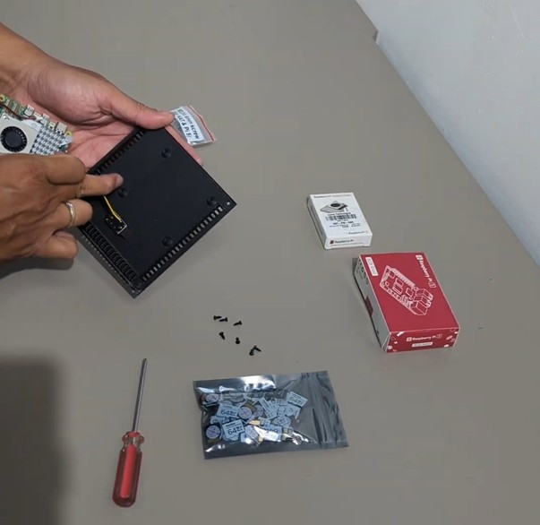 |
| 1.5 | Align them with the holes on the plate. | 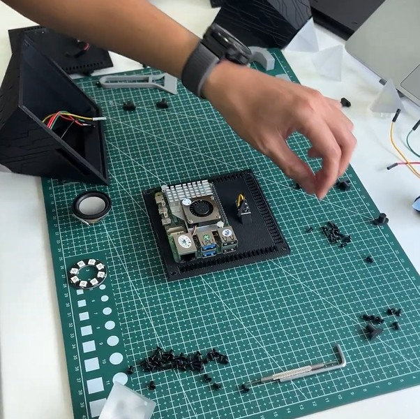 |
| 1.6 | Secure the board to the plate with the M2.3 screws. | 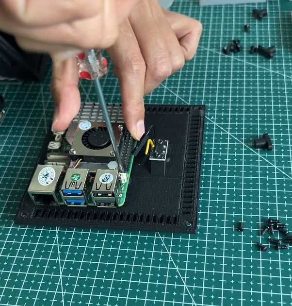 |
| 2 | Prepare the housing. | 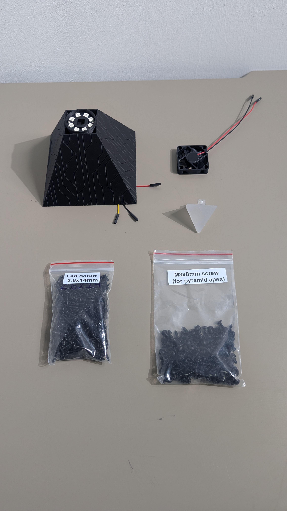 |
| 2.1 | - Secure the apex with one M3 x 8mm screw. - Mount the fan to the housing with four M2.6 x 14mm screws. | 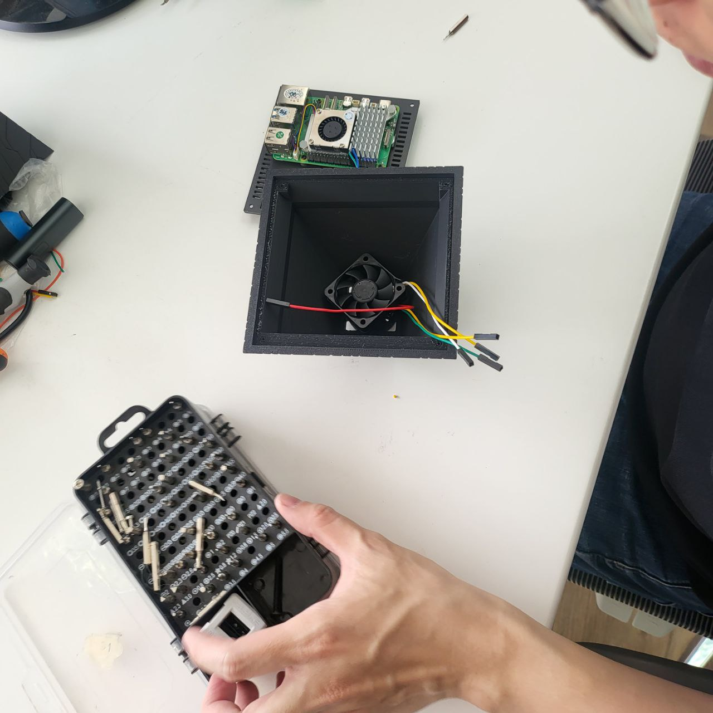 |
| 3 | Connect the board and assemble the housing. | 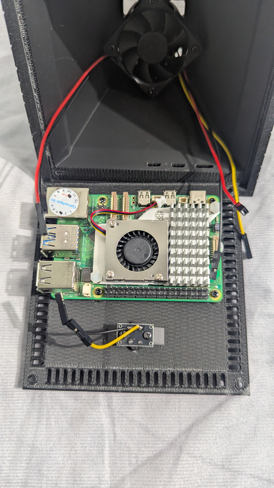 |
| 3.1 | - Plug the fan cable into the 4-pin JST fan connector at the top right of the board. This lets the Pi 5 manage fan speeds automatically based on system temperature. - Connect the PW and GND pins to the momentary push button. - Connect the LED ring and cooling fan as shown. | 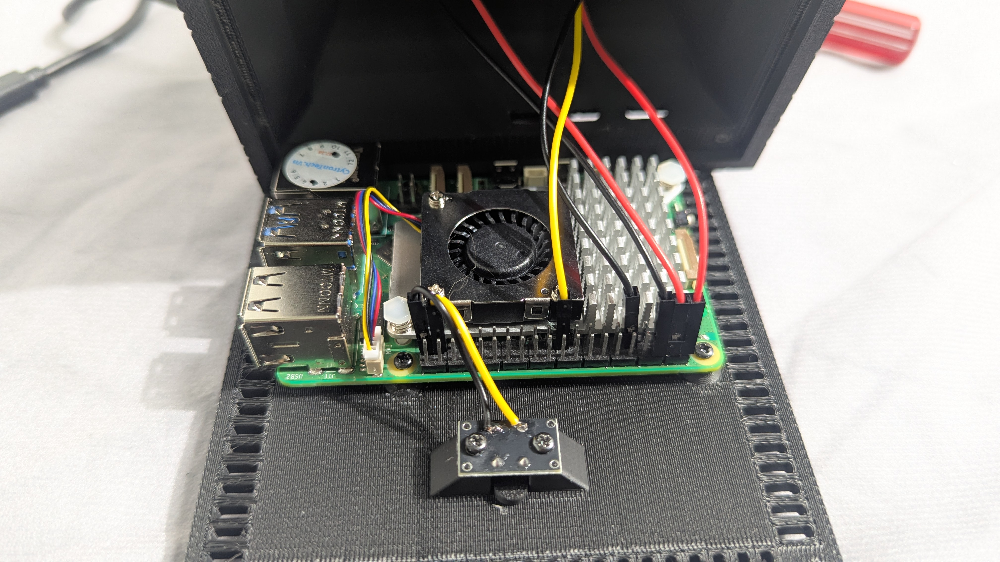 |
| 3.2 | Assemble the base plate with the housing. | 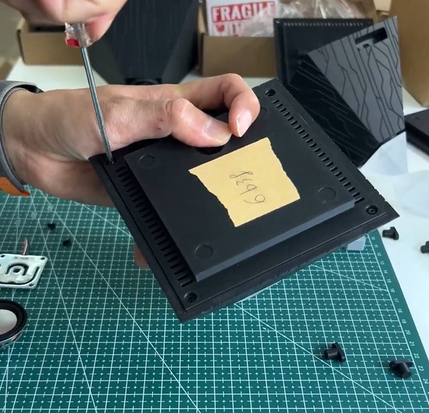 |
| 3.3 | Plug in the power supply through the USB-C port. | 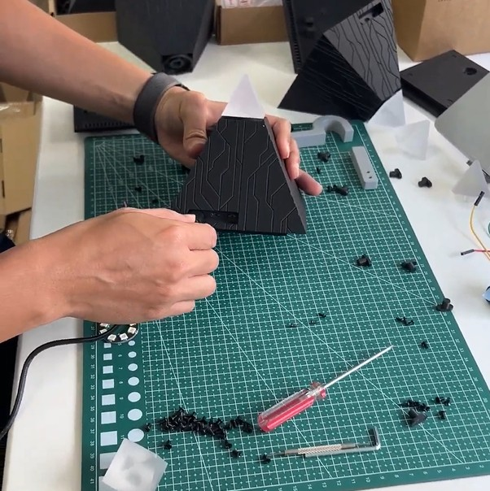 |
| 3.4 | Your intern is ready for setup. | 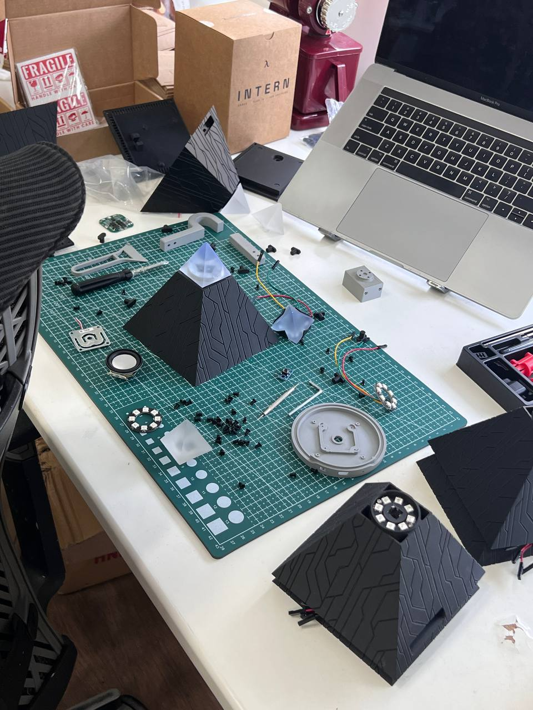 |
