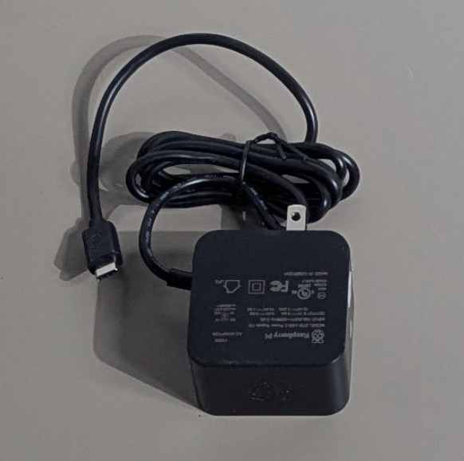
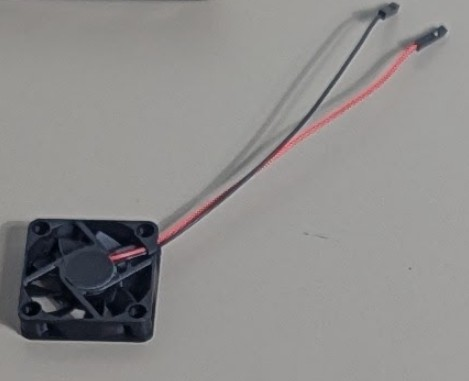
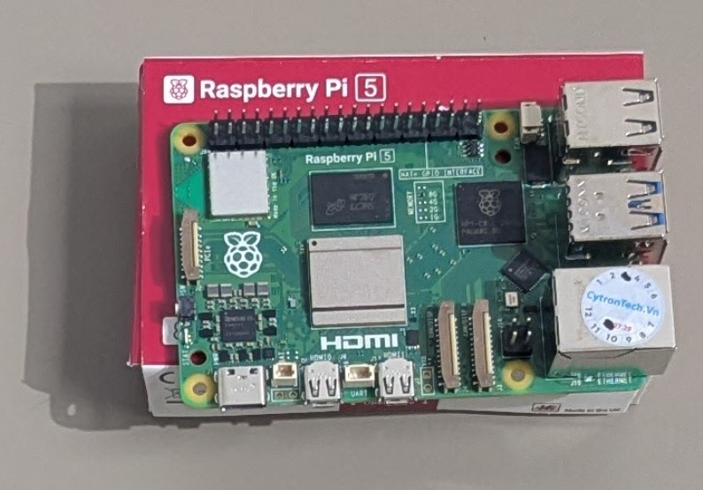
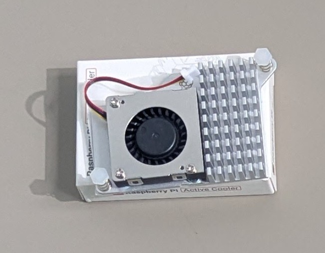
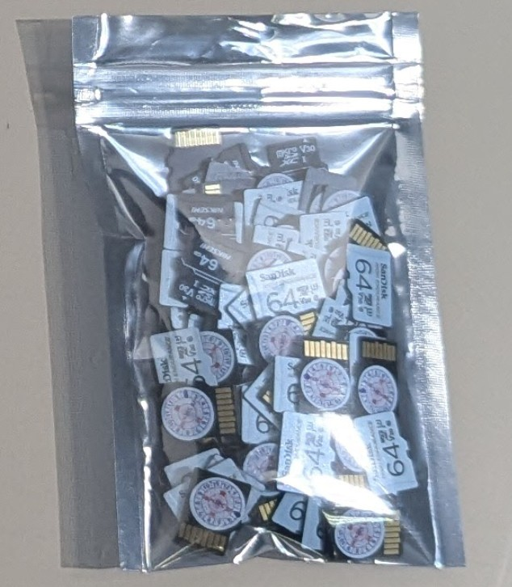
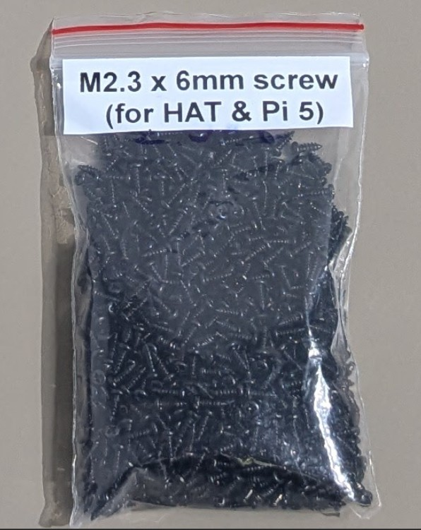
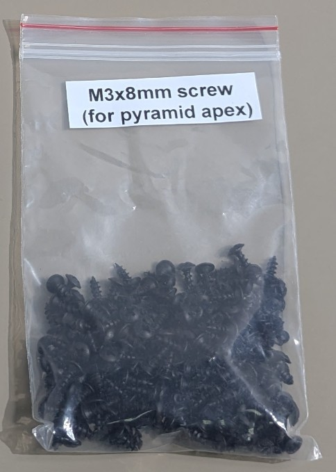
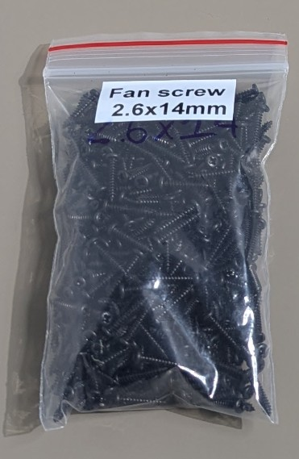
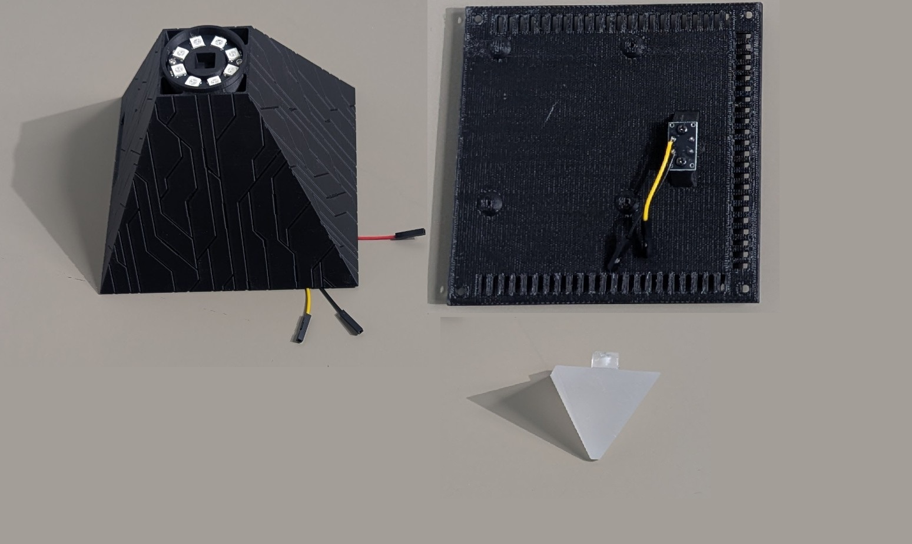

# List of Materials

| No | Item | Qty | Category | Photo | Notes |
|:-:|:-:|:-:|:-:|:-:|:-:|
| 1 | Power supply — USB-C Adapter Output: 5.1V, 5.0A, 27W 100-240VAC PD support at 9V/3A, 12V/2.25A and 15V/1.8A | 1 | Power Supply |  | |
| 2 | Secondary cooling fan | 1 | Cooling |  | |
| 3 | Raspberry Pi 5 | 1 | Mainboard |  | |
| 4 | Raspberry Pi Active Cooler | 1 | Cooling |  | |
| 5 | Micro SD card: 64GB | 1 | Storage |  | |
| 7 | M2.3 x 6mm screw for the Raspberry board | 8 | Screw |  | |
| 9 | M3 x 8mm screw for the Pyramid Apex | 1 | Screw |  | |
| 11 | M2.6 x 14mm screw for the fan | 4 | Screw |  | |
| 13 | Frame housing | 1 | Housing |  | 1 set (full) |
